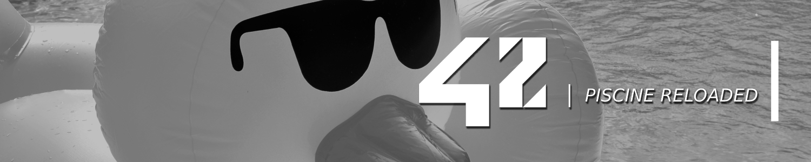

# 🏊🏽‍♂️ 42sp - Piscine Reloaded

<picture>
	
</picture>
<picture >
	
</picture>
<picture >
	
</picture>
<picture >
	
</picture>

##

This repository is a review of all concepts from Piscine. You need to remake most important exercices and review concepts of peer-to-peer evaluation.

## Projects

